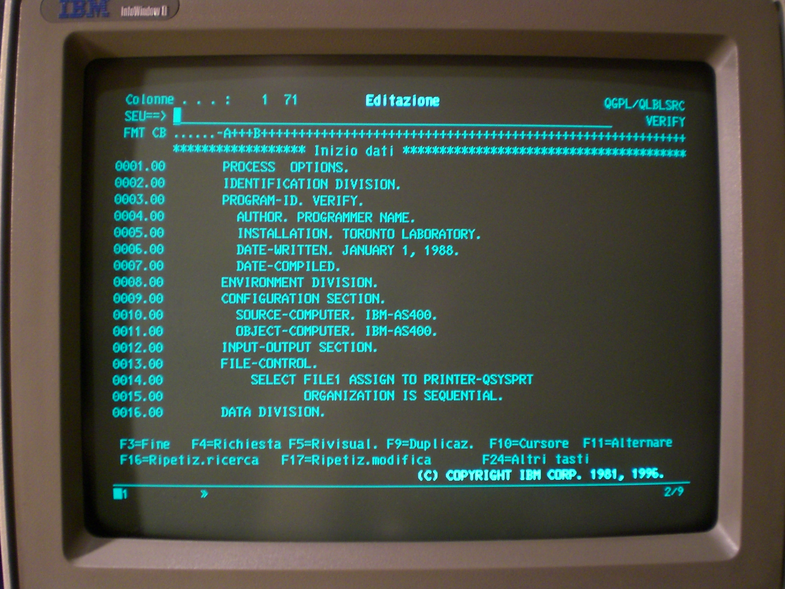
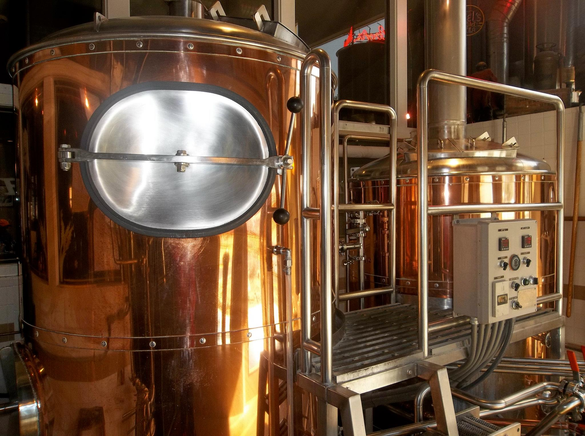

# #8 Forming clouds: CloudFormation vs Ansible vs TerraForm


---


---

# Geert Theys


*Sales guy @skyscrapers*

Still likes to get his hands dirty.
<br>
 [github.com/gtheys](https://github.com/gtheys)
 [twitter.com/toadi](https://twitter.com/toadi)
 [geerttheys.com](http://geerttheys.com)

---

# Mattias Gees


*Cloud Engineer @skyscrapers*

Likes to experiment!
<br>
 [github.com/mattiasgees](https://github.com/mattiasgees)
 [twitter.com/mattiasgees](https://twitter.com/mattiasgees)
 [blog.mattiasgees.be](http://blog.mattiasgees.be)

---

# [fit] CloudFormation
# [fit] <> Terraform
# [fit] <> Ansible
# [fit] for AWS provisioning

---

# [fit] All different tools

---

# [fit] All have their advantages


---

# [fit] And disadvantages

---

# Before we start!


---

# [fit] Lets compare

---

# [fit] Simple syntax?

---

# CloudFormation:

```json
"web01" : {
  "Type" : "AWS::EC2::Instance",
  "Properties" : {
    "AvailabilityZone" : "eu-west-1a",
    "ImageId" : { "Ref" : "imageami" },
    "InstanceType" : { "Ref" : "webInstanceType" },
    "KeyName" : { "Ref": "opKeyName"},
    "SubnetId" : { "Ref" : "PublicSubnet1a" },
    "BlockDeviceMappings" : [ {
      "DeviceName" : "/dev/sda1",
      "Ebs" : {
        "VolumeType" : "standard",
        "DeleteOnTermination" : "false",
        "VolumeSize" : "8"
      }
    } ],
    "Tags" : [
      {"Key" : "Application", "Value" : { "Ref" : "AWS::StackId" } },
      {"Key" : "Environment", "Value" : { "Ref" : "environmentType" } },
      {"Key" : "Project", "Value" : { "Ref" : "projectName" } },
      {"Key" : "Name", "Value" : { "Fn::Join" : [ "-", [ "web01", { "Ref" : "projectName" }, { "Ref" : "environmentType" }] ] } }
    ],
    "SecurityGroupIds" : [ {"Ref" : "sgweb"} ],
    "UserData"       : { "Fn::Base64" : { "Fn::Join" : ["", [
      "#!/bin/bash\n",
      "/usr/bin/logger -t autobootstrap \"Run apt-get update\"\n",
      "sudo apt-get update\n",
      "/usr/bin/logger -t autobootstrap \"Install nginx\"\n",
      "sudo apt-get install nginx -y\n",
      "/usr/bin/logger -t autobootstrap \"Start nginx\"\n",
      "sudo service nginx start\n"
    ]]}}
  }
},
```

---

# Terraform:

```
resource "aws_instance" "web" {
  count = "${var.web_nodes}"
  ami = "${var.ami}"
  instance_type = "${var.instance_type}"
  subnet_id = "${element(aws_subnet.public_subnets.*.id, count.index)}"
  key_name  = "${var.key_name}"
  security_groups  = ["${aws_security_group.sg_web.id}"]
  user_data = "${template_file.metadata_web.rendered}"

  root_block_device {
    volume_type = "standard"
    volume_size = "8"
    delete_on_termination = "false"
  }

  tags {
    Name = "${var.project}-${var.environment}-web0${count.index + 1}"
    Environment = "${var.environment}"
    Project = "${var.project}"
  }
}

resource "template_file" "metadata_web" {
    filename = "templates/metadata.tpl"
}
```

---

# Ansible:

```
 - name: WebServer | Create the WebServer Instance(s)
   local_action:
     module: ec2
     region: "{{ vpc_region }}"
     group: "{{ web_security_groups[0].sg_name }}"
     keypair: "{{ key_name }}"
     instance_type: "{{ web_instance_type }}"
     image: "{{ imgae_id.ami }}"
     vpc_subnet_id: "{{ item }}"
     assign_public_ip: True
     wait: True
     wait_timeout: 600
     user_data: |
               #!/bin/sh
               sudo apt-get install nginx -y
     instance_tags:
       Name: "{{ vpc_name }}_WEB_Instance"
       Environment: "{{ ENV }}"
       Role: "{{ server_role }}"
       Application: "{{ application }}"
   with_items:
      - "{{ public_subnet_1 }}"
      - "{{ public_subnet_2 }}"
   register: web
```
---

# [fit] Which one was the easiest to read?

---

# Easy to install?



### Macosx has the fantastic brew:

* `brew install awscli`
* `brew install terraform`
* `brew install ansible`

__Warning:__ None are up to date!

Up to date versions and on linux use `pip install`

---


# [fit]Safe to use?

### [fit] Terraform and Ansible have a `plan` or `--dry-run` mode

---

# Performant?
* CloudFormation:
    * Parallelizes as much as possible
* Terraform:
    * Use dependency graph and parallelizes as much as possible
    * Partial refresh before changes
* Ansible: Forks? SSH tuning... Not really

---

# How do they keep state?

---

# Do I feel safe

* CloudFormation:
    * State is stored on AWS
    * Start to pray when you run it
    * Roll back on fail

* Terraform:
    * Partial State get's stored on error (eg. sg gets created not the rules, next run will fix this)
    * Create before destroy

---

# Issues?

* CloudFormation:
    * JSON
    * No `plan` mode

* Terraform:
    * Not yet good working on existing interfaces
    * No full coverage of AWS

---

# Legacy projects?

---

# Support?

---

# Do you look cool when using it?

---

# Do I want to use it?

* Destroy ordering
---

# Do we recommend 1?

---
