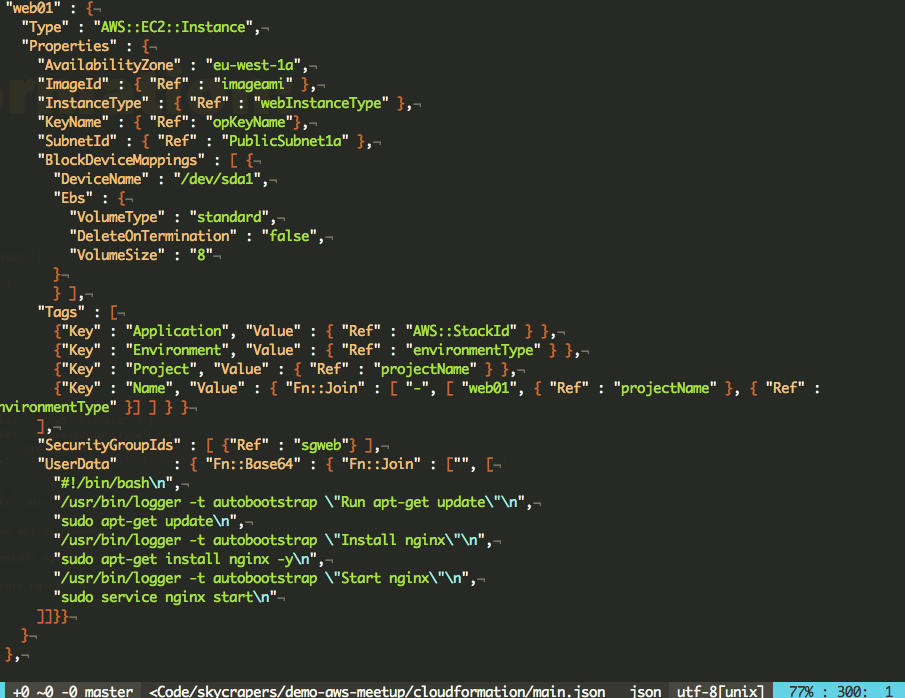
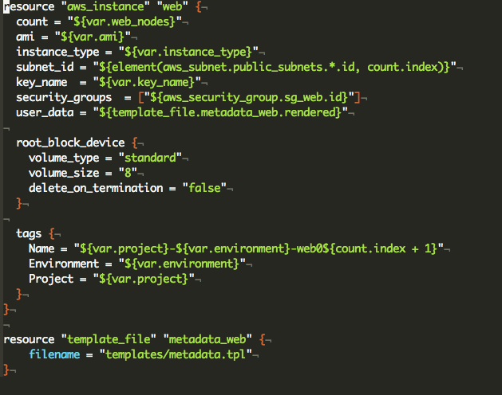
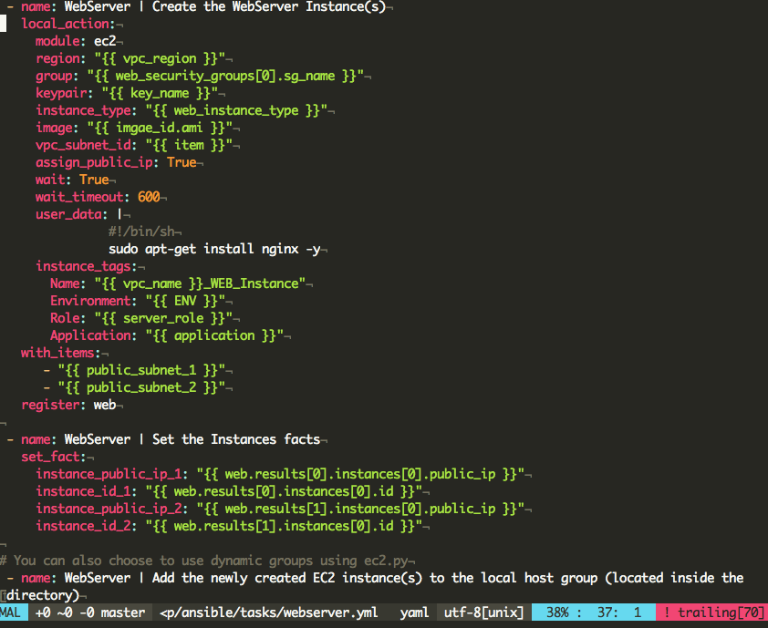

# #8 Forming clouds: CloudFormation vs Ansible vs TerraForm

---

---

# Geert Theys

*Sales guy @skyscrapers*

Still likes to get his hands dirty.
 
 [github.com/gtheys](https://github.com/gtheys)
 [twitter.com/toadi](https://twitter.com/toadi)
 [geerttheys.com](http://geerttheys.com)

---

# Mattias Gees

*Cloud Engineer @skyscrapers*

Likes to experiment!
 
 [github.com/mattiasgees](https://github.com/mattiasgees)
 [twitter.com/mattiasgees](https://twitter.com/mattiasgees)
 [blog.mattiasgees.be](http://blog.mattiasgees.be)

---

# [fit] CloudFormation
# [fit] <> Terraform
# [fit] <> Ansible
# [fit] for AWS provisioning

---

# [fit] All different tools

##[fit] and there are many others!

---

# [fit] All have their advantages

---

# [fit] And disadvantages

---

# Before we start!

---

# [fit] Lets compare

---

# [fit] Simple syntax?

---

# CloudFormation:

---

# Terraform:

---

# Ansible:

---

# [fit] Which one was the easiest to read?

---

# Easy to install?

### Package managers:

* `brew install`
* `apt-get install`
* `yum install`

__Warning:__ None are up to date!

Latest versions pip and/or sources

---

# [fit]Safe to use?

## [fit] Terraform and Ansible have a __plan__ or __--check__ mode

---
# Productive?

---

# It's running ;)

* CloudFormation:
    * Parallelizes as much as possible
* Terraform:
    * Use dependency graph and parallelizes as much as possible
    * Partial refresh before changes
* Ansible:
    * Forks? SSH tuning? 

---

# How do they keep state?

* Cloudformation on AWS
* Terraform creates a state file
* Ansible ad hoc state

---

# Do I feel safe
* CloudFormation:
    * Start to pray when you run it
    * Roll back on fail
* Terraform:
    * Partial State gets stored on error (eg. sg gets created not the rules, next run will fix this)
    * Create before destroy
* Ansible: Stops on failure

---

# Issues?

* CloudFormation:
    * JSON
    * No partial run possible
* Terraform:
    * No full coverage of AWS
* Ansible:
    * Not every aws module has --dry-run check mode!

---

# Legacy projects?
* Cloudformation: [Cloudformer](https://aws.amazon.com/developertools/6460180344805680)
* Terraform: [Terraforming](https://github.com/dtan4/terraforming)
* Ansible: Just do it

---

---

# Do you look cool when using it?

---

# Do I want to use it?

* Terraform: Destroy ordering, clean and readable, focus on 1 thing
* Ansible: It's simple
* Cloudformation: Who likes JSON?

---

# [fit] Do we recommend 1?

---

# [fit]Questions?

## [fit] Presentation + demo on [github.com/skyscrapers/demo-aws-meetup](https://github.com/skyscrapers/demo-aws-meetup)

---
